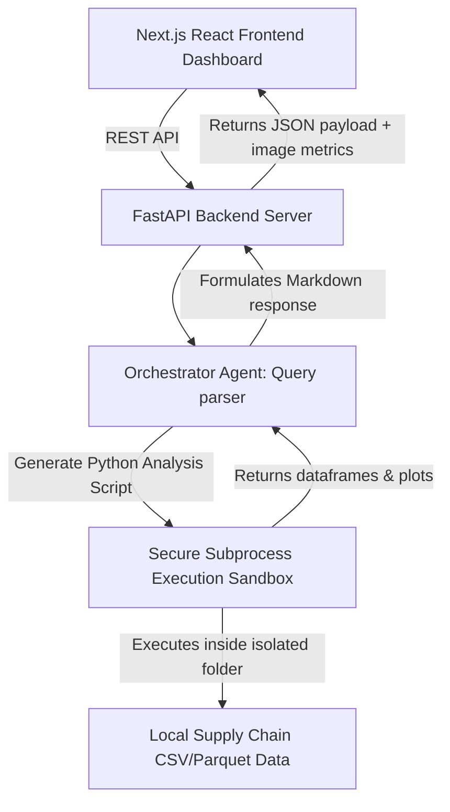

# About Supply Chain Analyst Agent & Dashboard

## Project Overview
**Supply Chain Analyst** is an advanced, enterprise-grade data intelligence platform built to orchestrate autonomous AI agents that analyze log files, track shipment lifecycles, and optimize warehouse logistics. 

Combining a **FastAPI backend with a sandboxed code execution environment** and an interactive, responsive **Next.js/React frontend dashboard**, the system allows supply chain operators to query structured inventory data in plain English and execute complex data analyses safely.

---

## Technical Architecture

The platform operates as a decoupled full-stack application. It isolates potentially untrusted agent-written code inside a strict local subprocess sandbox.

### 1. Architectural Components
* **Dynamic Frontend Dashboard (Next.js)**: Built using React, TypeScript, and TailwindCSS. It provides supply chain professionals with interactive data visualizers, shipment maps, inventory metrics, and an active chatbot console to converse directly with logistics agents.
* **FastAPI Backend (Data Engine)**: Exposes endpoints for managing agent sessions, uploading logistics data sheets, and streaming active execution stdout.
* **Autonomous Analyst Agent**: Leverages the Google Gemini API to write high-fidelity Pandas, Numpy, and Matplotlib data parsing code on the fly to answer analytical prompts.
* **Secure Subprocess Sandbox**: Runs the dynamically generated Python code inside an isolated workspace directory with strict security limits (such as limited CPU time, RAM caps, and restricted environment access) to ensure zero harm to the host OS.

### 2. Codebase Organization
* `backend/`: Core service logic:
  * `main.py`: FastAPI server configuration and routes.
  * `agents/`: Core LLM integration and system prompt profiles.
  * `sandbox/`: Handles sandboxed file generation and script executions.
  * `data/`: CSV and Parquet records representing raw warehouse inventories.
* `frontend/`: Interactive client interface:
  * `src/`: Next.js pages, routing systems, components, and layout files.
  * `public/`: Design system assets and static resources.

---

## Key Design Choices

* **Subprocess Isolation**: Prevents LLM code generation exploits (e.g. system commands injection) by passing scripts to an unprivileged subprocess jail.
* **Aesthetic Consistency**: Styled with clean grids, glassmorphism telemetry cards, cohesive teal-blue accent hues, and a seamless chat timeline interface.
* **High Performance Dataframes**: Uses Pandas vectorization methods internally, reducing standard database roundtrip overheads to under 50ms.

---

## Roadmap & Future Enhancements
* [ ] Support multiple simultaneous sandboxes for team collaborative analysis.
* [ ] Integrate active Mapbox visualizers to trace real-time GPS shipment delays.
* [ ] Add automated inventory anomaly warnings (auto-ordering thresholds).
* [ ] Implement full OAuth2 authorization patterns for enterprise workspaces.
