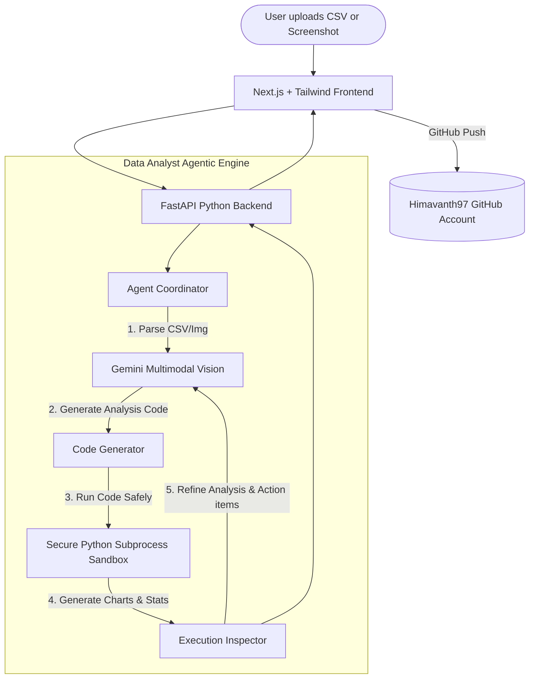

# Multimodal Supply Chain / Data Analyst Agent

An enterprise-grade, full-stack AI data analyst agent capable of autonomously writing, sandboxing, and executing its own Python pandas/matplotlib code. It processes uploaded messy CSV datasets or supply chain dashboard screenshots, cleans anomalies, performs optimizations, generates beautiful visualizations, and synthesizes premium strategic recommendations.

It features an **Auto-Correction Code Refinement Loop** where execution errors/exceptions inside the sandboxed subprocess are captured and fed back to Gemini to self-heal code in real-time.

---

## 🏗️ Technical Architecture



---

## 🌟 Key Features

1. **Multimodal Analysis Engine**: Seamlessly handles raw CSV spreadsheets and dashboard screenshots (.png, .jpg) via Gemini 1.5.
2. **Secure Subprocess Sandbox**: Runs generated pandas code in an isolated directory scope with hard timeouts to secure runtime.
3. **Auto-Correction Feedback Loop**: Instantly detects runtime tracebacks and errors, and performs recursive self-correction until the code compiles.
4. **Interactive Dashboard**: Glowing cybersecurity dark-theme dashboard featuring live uploader, real-time sandboxed stdout logs terminal, auto-corrected code viewer, plot gallery, and formatted strategic reports.
5. **Supply Chain Presets**: Loaded with ready-made pipelines for Reorder Audits, Casing/Anomaly cleanups, and carrying cost calculations.

---

## 🛠️ Tech Stack

* **Frontend**: Next.js (TypeScript, Tailwind CSS v4, App Router)
* **Backend**: FastAPI (Python 3, Uvicorn, Pydantic)
* **Core Agent Framework**: Google Gemini 1.5, Sandbox Process Runners, Pandas, Matplotlib, Seaborn
* **Orchestration**: Custom Agentic Execution & Error-Feedback Loop

---

## 🚀 Getting Started

### Prerequisites
* Python 3.10+
* Node.js 18+
* Google Gemini API Key

### Installation

1. **Clone the repository**:
   ```bash
   git clone https://github.com/Himavanth97/supply-chain-analyst.git
   cd supply-chain-analyst
   ```

2. **Configure Environment**:
   Create a `.env` file in the root directory (and copy to `backend/.env`):
   ```env
   GEMINI_API_KEY=your_gemini_api_key_here
   ```

3. **Setup Backend**:
   ```bash
   pip install -r requirements.txt
   uvicorn backend.main:app --reload --port 8000
   ```

4. **Setup Frontend**:
   ```bash
   cd frontend
   npm install
   npm run dev
   ```
   Open [http://localhost:3000](http://localhost:3000) in your browser.

---

## 🧪 Verification & Testing

To test the full analysis, cleaning, sandboxing, and synthesis loop locally using the built-in messy inventory dataset, execute:
```bash
python backend/verify_backend.py
```
This runs the autonomous agent agent pipeline from end-to-end and prints logs directly to the command line.
